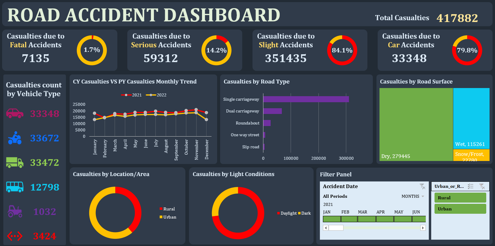

# Road Accident Dashboard

This project is an **Excel-based interactive dashboard** analyzing road accident data.  
It demonstrates data cleaning, exploratory analysis, KPI creation, and visualization techniques to facilitate a better understanding of accident patterns.

---

---

## 📂 Project Structure
- `Road Accident Data.xlsx`
- `Original Dataset Sheet` (inside Excel file) — raw data used for the dashboard.
- `Data Analysis Sheet` (inside Excel file) — contains formulas, pivot tables, and notes for reproducibility.
- `Dashboard Sheet` (inside Excel file) — interactive charts, KPIs, slicers, and timeline.

---

## 📂 Dataset
The full Excel dataset is hosted externally due to size limits.  

👉 [Download Road Accident Data (Excel file)](https://1drv.ms/x/c/4f231999c1c27b6e/Eb-fGv823-9PjUsEWyM7oWMBP9NEefE4JjTYDmPbtLt5Kg?e=5zFOHv)

---

## 🛠 Steps Performed
1. **Data Cleaning**
   - Fixed typos (e.g., `fetal` → `fatal`).
   - Removed inconsistencies in categorical data.
   - Derived new columns:  
     - `Month` (`=TEXT(Date,"mmm")`)  
     - `Year` (`=TEXT(Date,"yyyy")`)

2. **Exploratory Analysis**
   - Built pivot tables to analyze accident severity, vehicle type, location, and road conditions.
   - Calculated accident KPIs: Total Accidents, Fatal Accidents, Casualties.

3. **Dashboard Creation**
   - Added donut charts for accident severity distribution.
   - Inserted trend chart (monthly accidents).
   - Used a **timeline slicer** for year-based filtering.
   - Created navigation buttons for easy switching between sheets.
   - Designed a clean layout with titles, slicers, and KPI cards.

4. **Documentation**
   - Added an **Analysis Sheet** with pivot logic and notes for future reference.

---

## 🚀 How to Use
1. Clone or download this repository.  
2. Open **`Road Accident Data.xlsx`** in Microsoft Excel.  
3. Explore:
   - **Dashboard sheet** for visuals.
   - **Analysis sheet** for formulas and pivot logic.
   - **Raw data sheet** for original entries.

---

## 🔧 Tools Used
- Microsoft Excel (Pivot Tables, Charts, Slicers, Conditional Formatting)
- Basic Data Cleaning Functions (Find & Replace, Derived Columns)

---

## 📌 Key Insights
- Visualizes accident severity across months and years.
- Shows patterns in accident causes and vehicle types.
- Provides KPIs for quick monitoring of total and fatal accidents.

---

## 📄 Project Purpose
This project was created as a **portfolio piece** to demonstrate:
- Data cleaning and transformation in Excel.
- Building interactive dashboards.
- Presenting insights in a clear, structured format.

---

## 👩‍💻 Author
Mrunal Rawade  
*Created as part of a Data Analytics learning journey and apprenticeship preparation.*

---

## 📜 License
This project is licensed under the MIT License.
